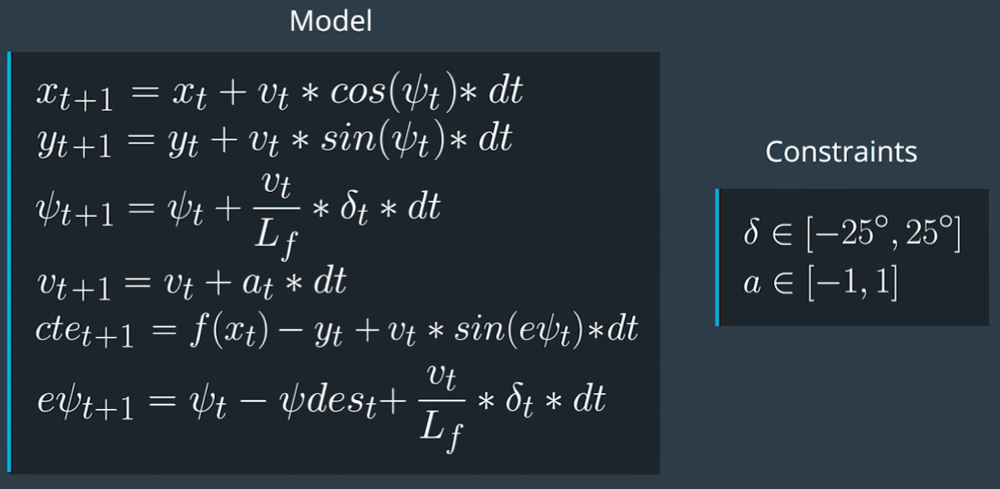
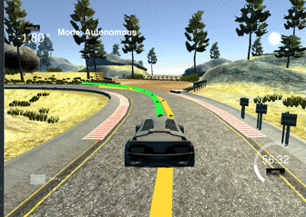
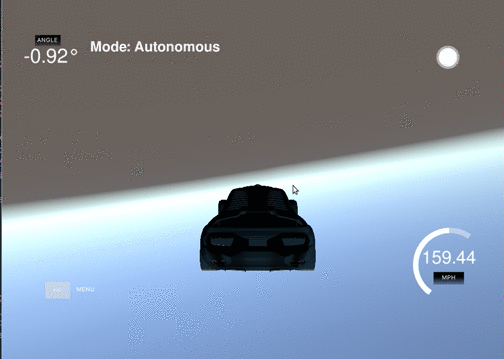

# Model Predictive Control Project
Self-Driving Car Engineer Nanodegree Program


---

## Project rubric points

### The model: 
The model used is the kinematic model presented in the lectures. The model consists of six state variables: x,y position, the vehicles orientation angle psi, the vehicle's velocity v as well as the cross tracking and orientation error cte resp. epsi. The control / actuation variables are the steering angle delta and the longitudinal acceleration a (gas/brake pedal). The equations and constraints are shown below.



The cost / objective function combines several objectives. First and foremost it enforces only small deviations from the planned trajectory. This is ensured by an appropriate parameterization of the objective function, which prioritizes trajectory deviations.
The objective function also considers deviations from the reference velocity as well as strong actuation controls. Further the function penalizes the change rate of the controls in order to avoid bucking.

```c++
// setting up the cost function
    // ########################################################
    fg[0] = 0;
    for (size_t t = 0; t < N; ++t) {
      fg[0] += 1000 * CppAD::pow(vars[cte_start + t], 2);
      fg[0] += 1000 * CppAD::pow(vars[epsi_start + t], 2);
      // penalize deviations from ref speed
      fg[0] += CppAD::pow(vars[v_start + t] - ref_v, 2);
    }

    // Minimize the use of actuators.
    for (size_t t = 0; t < N - 1; ++t) {
      fg[0] += CppAD::pow(vars[delta_start + t], 2);
      fg[0] += CppAD::pow(vars[a_start + t], 2);
    }

    // Minimize the value gap between sequential actuations.
    for (size_t t = 0; t < N - 2; ++t) {
      fg[0] += CppAD::pow(vars[delta_start + t + 1] - vars[delta_start + t], 2);
      fg[0] += CppAD::pow(vars[a_start + t + 1] - vars[a_start + t], 2);
    }
```




### Timestep length and elapsed duration (N & dt)
The prediction horizon N and the prediction frequency were chosen experimentally. 
Starting with the parameters from the "mind the line" project N=25, dt=0.05 the parameters were both independently increased and decreased. The optimal values found are N=10 and dt=0.1. A longer prediction horizon N>10 results in worse short-term controls due to the  increased uncertainty. A more complex model which takes the increasing uncertainty over time into account e.g. by weighting short-term predictions higher, might improve the performance.
On the other hand N<10 also leads to worse performance, since the planned short-term trajectory fails to anticipate important road conditions (e.g. curves).
The update frequency is highly dependent on the control latency. An update frequency which is equal to the latency allows an easy handling of the problems that arise when dealing with latency. More on that in the latency section.

### Polynomial fitting and MPC preprocessing
The state variables and waypoint coordinates are in global map coordinates. 
All variables are transformed to local vehicle coordinates. The reference trajectory is 
derived from these transformed waypoints by fitting a third degree polynomial accroding to the vehicle's perspective. The rotation is performed using the rotation matrix below, where the x,y coordinates are the differences between the waypoint and vehicle coordinates.


Source: wikipedia

### Model predictive control with latency
The control outputs are only processed with 100ms latency. This leads to an instable controller behavior if it is not considered. 
To account for this delay, the prediction time was set to the same 100ms interval. This way 
the latency can be corrected easily by replacing the current control actuations with the 
controls from the previous predicions, which arrive at the time of the new prediction, as shown below.

```c++
// handling the control latency
      double delay = latency / dt;
      if (t > delay) {
        a0 = vars[a_start + t - (1 + delay)];
        delta0 = vars[delta_start + t - (1 + delay)];
      } else {
        a0 = vars[a_start + t -1];
        delta0 = vars[delta_start + t -1];
      }
```

Result without taking latency into account:



### Miscellaneous
Some template functions were changed to improve speed, mainly replacing call by value with call by reference, especially for bigger data structures like vectors and Eigen Vectors/Matrices.


## Dependencies

* cmake >= 3.5
 * All OSes: [click here for installation instructions](https://cmake.org/install/)
* make >= 4.1(mac, linux), 3.81(Windows)
  * Linux: make is installed by default on most Linux distros
  * Mac: [install Xcode command line tools to get make](https://developer.apple.com/xcode/features/)
  * Windows: [Click here for installation instructions](http://gnuwin32.sourceforge.net/packages/make.htm)
* gcc/g++ >= 5.4
  * Linux: gcc / g++ is installed by default on most Linux distros
  * Mac: same deal as make - [install Xcode command line tools]((https://developer.apple.com/xcode/features/)
  * Windows: recommend using [MinGW](http://www.mingw.org/)
* [uWebSockets](https://github.com/uWebSockets/uWebSockets)
  * Run either `install-mac.sh` or `install-ubuntu.sh`.
  * If you install from source, checkout to commit `e94b6e1`, i.e.
    ```
    git clone https://github.com/uWebSockets/uWebSockets
    cd uWebSockets
    git checkout e94b6e1
    ```
    Some function signatures have changed in v0.14.x. See [this PR](https://github.com/udacity/CarND-MPC-Project/pull/3) for more details.

* **Ipopt and CppAD:** Please refer to [this document](https://github.com/udacity/CarND-MPC-Project/blob/master/install_Ipopt_CppAD.md) for installation instructions.
* [Eigen](http://eigen.tuxfamily.org/index.php?title=Main_Page). This is already part of the repo so you shouldn't have to worry about it.
* Simulator. You can download these from the [releases tab](https://github.com/udacity/self-driving-car-sim/releases).
* Not a dependency but read the [DATA.md](./DATA.md) for a description of the data sent back from the simulator.


## Basic Build Instructions

1. Clone this repo.
2. Make a build directory: `mkdir build && cd build`
3. Compile: `cmake .. && make`
4. Run it: `./mpc`.

